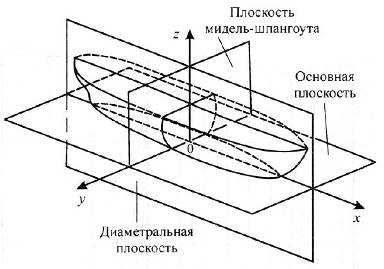
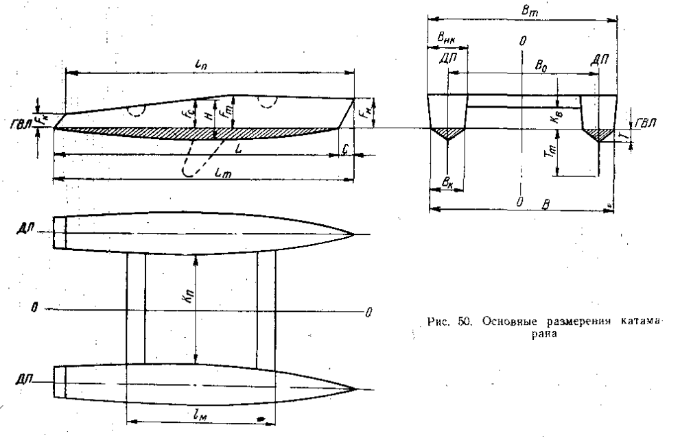

# Значенение терминов и их соответствия в английской терминологии

Взято из книги *Крючков Ю.С., Лапин В.И. "Парусные катамараны"* (1963), с. 115

## Сокращения

- ДП - диаметральная плоскость - в теории корабля вертикальная продольная плоскость, представляющая плоскость симметрии корабля (судна). Диаметральная плоскость проходит через всю длину судна и делит его на две симметричные части.

- ГВЛ - грузовая ватерлиния

## Главные размерения

1. ***длина по ГВЛ (конструкционная длина) / loaded waterline length or L.W.L*** - расстояние между точками пересечения грузовой ватерлинии с форштевнем и ахтерштевнем. (L)

2. ***длина наибольшая (полная) / length overall or LOA*** - расстояние между крайними точками носовой и кормовой оконечностей без учёта руля. 

3. ***длина по палубе*** - расстояние между крайними точками палубы; для совреенных катамаранов большей частью совпадает с наибольшей длиной.

4. ***ширина по ГВЛ катамарана / beam at waterline or BWL*** - расстояние между точками пересечения плоскости ГВЛ с крайними ветвями мидель-шпангоутов двух корпусов. (B)

5. ***ширина наибольшая катамарана / maximum beam*** - расстояние между крайними точками наружных бортов корпусов.

6. ***ширина конструктивная катамарана*** - расстояние между ДП двух корпусов.

7. ***ширина по ГВЛ корпуса*** - расстояние между точками пересечения плоскости ГВЛ с мидель-шпангоутом одного корпуса.

8. ***ширина наибольшая корпуса*** - расстояние между крайними точками бортов корпуса.

9. ***углубление (осадка корпуса) / draft*** - расстояние от ГВЛ до самой нижней точки киля корпуса без учета различных выступающих частей - рулей, швертов, винтов и т.п.

10. ***осадка швертом / centerboard draft*** - расстояние от ГВЛ до самой нижней точки опущенного шверта.

11. ***высота борта / depth*** - расстояние от нижней точки киля до палубы, измеренное на середине длины катамарана. Следует различать также высоту надводного борта в носу, в корме, максимальную и наименшую.

12. ***высота надводного борта / freeboard*** - - расстояние от ГВЛ до нижней кромки палубы, измеренное на середине длины катамарана. Следует различать также высоту надводного борта в носу, в корме, максимальную и наименшую.

13. ***вертикальный клиренс / vertical clearance*** - просвет между уровнем воды в споуойном состоянии и нижней поверхностью мостика катамарана. Измеряется расстоянием от ГВЛ до нижней кромки мостика по вертикали.

14. ***поперечный клиренс*** - просвет между двумя корпусами, измеряемый кратчайшим расстоянием между двумя корпусами в поперечном  направлении.

")

## Соотношение главных размерений и мореходные качества катамаранов

1. ***Отношение конструктивной ширины к длине по ГВЛ*** - определяет **остойчивость / stability** катамарана. 

    - при предварительных расчетах конструктивная ширина катамарана может приниматься в пределах от 50 до 33% от длины по ГВЛ. Большие значения относятся к малым катамаранам, меншие к крупным океанским суднам.

    - хорошую остойчивость катамарана обеспечивает значение `0.33-0.4`

2. ***Отношение наибольшей длины к наибольшей ширине*** - влияет на **остойчивость / stability**.

    - катамаран очтойчив и плавание на нём безопасно при значении `меньше 3`

    - минимальное значение равняется `2` (Более широкий катамаран становится плохо управляемым)

3. ***Отношение наибольшей длины к длине по ГВЛ*** - определяет **развитость свесов** катамарана и влияет на **общую мореходность / seaworthiness** судна.

    - для гоночных катамарнаов значение равняется `1.05-1.07` и редко увеличивается до `1.15-1.17`
  
    - океанские гоночные и крейсерские катамараны имеют более длинные свесы `1.1-1.3`
  
  
4. ***Отношение длины корпуса по ГВЛ к ширине корпуса по ГВЛ*** - определяет **ходкость / marine propulsion** яхты.

    - чем больше значение, тем острее судно и тем меньше сопротивление воды его движению

    - для современных быстроходных катамаранов равняется `15-20` (иногда достигает `40`)
  
  
5. ***Отношение длины по ГВЛ к высоте борта*** определяет **прочность /  strength** судна.

    - чем больше значение, тем меньше прочность
  
    - океанские крейсерские катамараны - `6.2-6.5`, реже `7-8`
  
    - небольште гоночные катамараны - `7-7.5`
  
  
6. ***Отношение ширины корпуса катамарана по ГВЛ к углублению*** - влияет на **ходкость / marine propulsion** яхты и **устойчивость на курсе / steadiness on course**

    - чем больше значение, тем хуже устойчивость на курсе
  

7. ***Отношение длины по ГВЛ к углублению*** - оказывает существенное влияние на **поворотливость /  turning capacity** катамарана
    
    - чем больше, тем хуже устойчивость на курсе
  

8. ***Отношение высоты борта к углублению*** - очень сильно влияет на **остойчивость / stability**, **непотопляемость / floodability** и **прочность / strength**

    - чем больше, тем лучше
  
  
9. ***Отношение вертикального клиренса к полной длине катамарана*** - влияет на **мореходность / seaworthiness**

10. ***Отношение длины среднего моста к наибольшей длине*** - влияет на **мореходные качества / seaworthiness** катамарана
